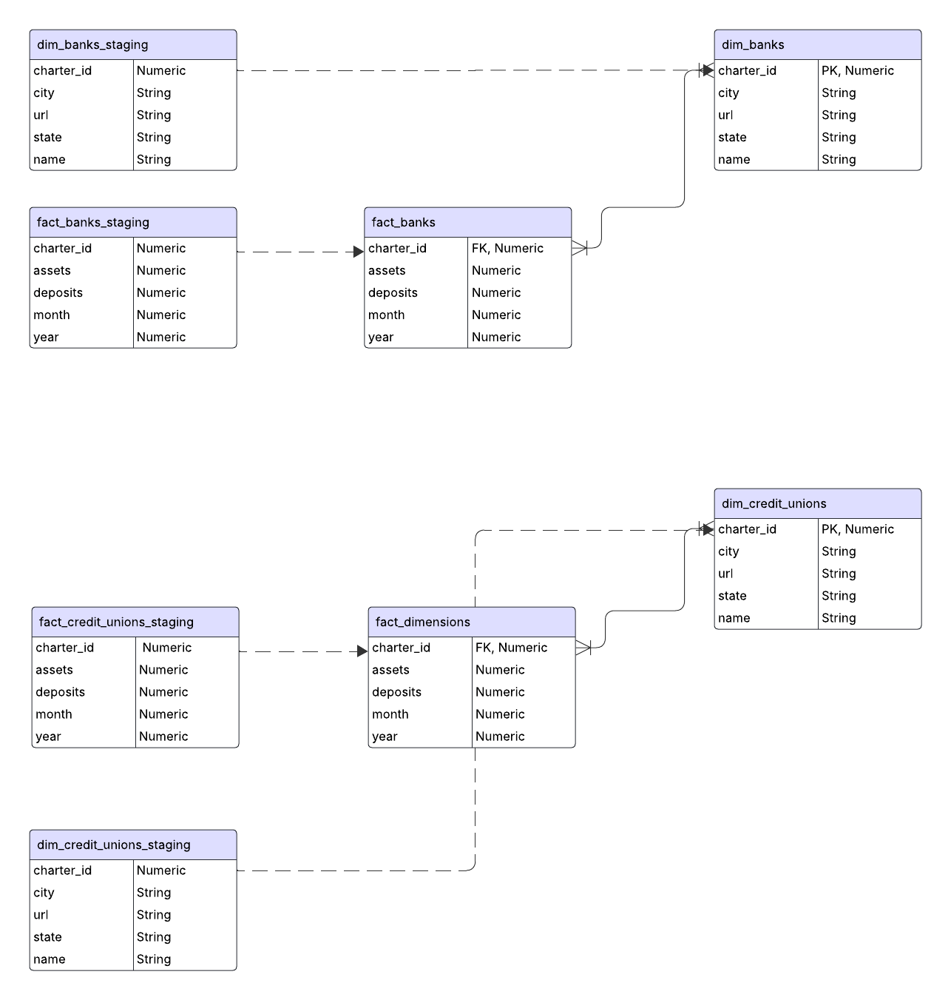
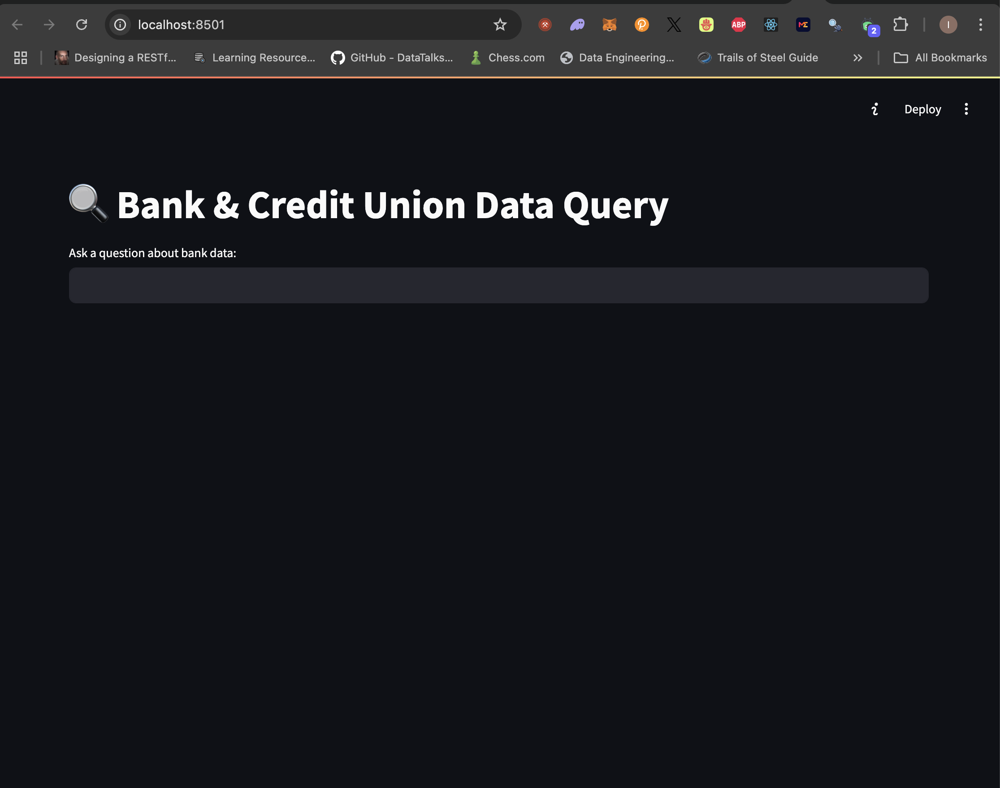
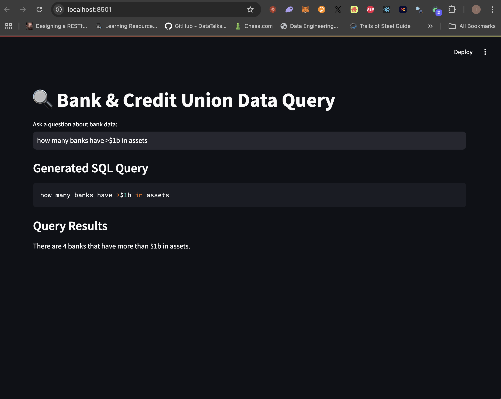

# Alpharank AI ETL Documentation

[](LICENSE)

## 📖 Table of Contents
- [About](#about)
- [How It Works](#how-it-works)
- [Entity-Relationship Diagram (ERD)](#entity-relationship-diagram-erd)
- [LLM Client](#llm)
- [Production Deployment](#production-deployment)
- [License](#license)


## 📌 About
This ETL extracts financial institution data from disparate sources and loads it into a **BigQuery** table.

## ⚙️ How It Works
1. **Fetch Data**  
   - The bank data is retrieved using [`scripts/fetch_data/get_bank_data.py`](scripts/fetch_data/get_bank_data.py).  
   - The credit union data is retrieved using [`scripts/fetch_data/get_credit_union_data.py`](scripts/fetch_data/get_credit_union_data.py).

2. **Transform & Load to GCS**  
   - The data is transformed and loaded into a **Google Cloud Storage (GCS)** bucket using scripts located in [`scripts/transform_data`](scripts/transform_data).

3. **Load to BigQuery Staging**  
   - The same transformation scripts then **truncate and write** the data into the appropriate **BigQuery staging tables**.

4. **Merge into Main Tables**  
   - The final step **merges** the staged data into the main BigQuery tables using [`scripts/load_data/write_to_table.py`](scripts/load_data/write_to_table.py).

---

## 🏗️ Entity-Relationship Diagram (ERD)

Here is the ERD diagram for this ETL process:



The data follows a **normalized relational model**, where staging tables serve as intermediate layers before loading into the main tables.

### **Fact and Dimension Relationships**
- The **fact and dimension tables** for **banks** and **credit unions** are linked via `charter_id`, ensuring referential integrity across the dataset.

---

### **🔍 SQL Queries for Analysis**
#### **How many banks and credit unions are active by asset tier?**
```sql
SELECT COUNT(*) AS total_number_of_institutions, 'bank' AS type
FROM `alpha-rank-ai.financial_institutions.fact_banks`
WHERE assets BETWEEN 500000000 AND 1000000000
AND year = 2024 AND month = 09

UNION ALL

SELECT COUNT(*) AS total_number_of_institutions, 'credit_union' AS type
FROM `alpha-rank-ai.financial_institutions.fact_credit_unions`
WHERE assets BETWEEN 500000000 AND 1000000000
AND year = 2024 AND month = 09;
```
#### **Which banks and credit unions experienced >5% decline in deposits last quarter?**
```sql
WITH get_periods AS (
    SELECT 
        MAX(year * 100 + month) AS latest_ym,
        CASE 
            WHEN MAX(month) = 3 THEN (MAX(year) - 1) * 100 + 12
            ELSE MAX(year) * 100 + (MAX(month) - 3)
        END AS previous_ym
    FROM `alpha-rank-ai.financial_institutions.fact_banks`
    WHERE year = 2024
),

latest AS (
    SELECT 
        charter_id, 
        SUM(deposits) AS latest_deposits, 
        year * 100 + month AS latest_ym
    FROM `alpha-rank-ai.financial_institutions.fact_banks`
    WHERE year * 100 + month = (SELECT latest_ym FROM get_periods)
    GROUP BY charter_id, year, month
),

previous AS (
    SELECT 
        charter_id, 
        SUM(deposits) AS prev_deposits, 
        year * 100 + month AS prev_ym
    FROM `alpha-rank-ai.financial_institutions.fact_banks`
    WHERE year * 100 + month = (SELECT previous_ym FROM get_periods)
    GROUP BY charter_id, year, month
),

final_bank as (SELECT 
    l.*, 
    p.prev_ym, 
    p.prev_deposits, 
    ROUND(SAFE_DIVIDE((l.latest_deposits - p.prev_deposits), p.prev_deposits) * 100, 2) AS deposit_change_pct,
    'bank' AS type
FROM latest l
LEFT JOIN previous p 
ON l.charter_id = p.charter_id
where ROUND(SAFE_DIVIDE((l.latest_deposits - p.prev_deposits), p.prev_deposits) * 100, 2) <= -5),

get_periods_credit_unions AS (
    SELECT 
        MAX(year * 100 + month) AS latest_ym,
        CASE 
            WHEN MAX(month) = 3 THEN (MAX(year) - 1) * 100 + 12
            ELSE MAX(year) * 100 + (MAX(month) - 3)
        END AS previous_ym
    FROM `alpha-rank-ai.financial_institutions.fact_credit_unions`
    WHERE year = 2024
),

credit_unions_latest AS (
    SELECT 
        charter_id, 
        SUM(deposits) AS latest_deposits, 
        year * 100 + month AS latest_ym
    FROM `alpha-rank-ai.financial_institutions.fact_credit_unions`
    WHERE year * 100 + month = (SELECT latest_ym FROM get_periods)
    GROUP BY charter_id, year, month
),

credit_unions_previous AS (
    SELECT 
        charter_id, 
        SUM(deposits) AS prev_deposits, 
        year * 100 + month AS prev_ym
    FROM `alpha-rank-ai.financial_institutions.fact_credit_unions`
    WHERE year * 100 + month = (SELECT previous_ym FROM get_periods)
    GROUP BY charter_id, year, month
),

final_credit_unions as (SELECT 
    l.*, 
    p.prev_ym, 
    p.prev_deposits, 
    ROUND(SAFE_DIVIDE((l.latest_deposits - p.prev_deposits), p.prev_deposits) * 100, 2) AS deposit_change_pct,
    'credit_union' AS type
FROM credit_unions_latest l
LEFT JOIN credit_unions_previous p 
ON l.charter_id = p.charter_id
where ROUND(SAFE_DIVIDE((l.latest_deposits - p.prev_deposits), p.prev_deposits) * 100, 2) <= -5)


select charter_id, latest_deposits, latest_ym, prev_ym, deposit_change_pct, type
from final_bank
union all 
select charter_id, latest_deposits, latest_ym, prev_ym, deposit_change_pct, type
from final_credit_unions;
```

### **LLM**
To use LLM run the following commands:
- To start frontend: uvicorn llm.backend:app --host 0.0.0.0 --port 8000 --reload
- To start backend: streamlit run llm.frontend.py
- Example on how it works below:




### 🛠️ **Production Deployment**  
In production, this ETL runs via **Apache Airflow**, using the DAG defined in [dag/dag_financial_institutions_etl.py](dag/dag_financial_institutions_etl.py).  
- **Schedule:** Runs on the day **after the end of each quarter**.